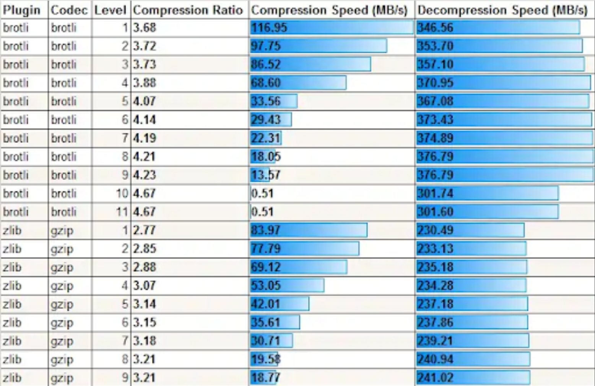

## Benchmark compression

## Requis

- [brotli](https://github.com/google/brotli/releases/download/v1.0.4/brotli-v1.0.4-win_x86_64.zip)
- [Cygwin](https://cygwin.com/) / Linux
- Fish shell (optionel pour dl les lots)

```sh
curl -L https://get.oh-my.fish > install
fish install --offline=omf.tar.gz
# echo 'db_shell: /usr/bin/fish' >> /etc/nsswitch.conf
```

#### Algorithmes (sans perte) testés :

- **LZMA2 (xz)** : un des meilleur taux de compression, meilleur que brotli sur de gros volumes. Toutefois lent et consommateur en CPU

- **Brotli** : Créer par google. Il utilise un algorithme de compression offrant une vitesse de décompression comparable à l'algorithme deflate, et un taux de compression proche de LZMA. Supporte peux de types de fichiers (image / texte seulement)

- **Deflate 64 / gzip** : temps de décompression rapide / taux de compression bas (le plus bas) / utilisation correcte du CPU

- **Zopfli (non testé)** : Aaussi créer par google qui présente des un équilibre intéressant entre taux de compression et vitesse (décomp / comp). Utilise les algos de gzip ou zlib avec de meilleurs résulats en compression mais pas en vitesse.

- **b2zip** : Taux de compression intéressant basé sur plusieurs outils (Burrows–Wheeler, tables de huffman) / grosse conso du CPU, single thread (voir pbzip2 pour le multi) / lent à la compression et rapide en decompression

#### Utile à connaître

> Un dictionnaire statique est assez efficace sur des types de fichiers simples comme du texte et des images.
> Un dictionnaire dynamique qui s'adapte aux types de données qu'il convertit est très efficace sur n'importe quels types de données mais consomme plus de CPU

**Résumé de l'étude :**

Avantage des différents algorithmes de compression selon les critères de **__temps__** (décompression / compression), **_usage du CPU_**, **_taux de compression_** et du **__type de dictionnaire__**

> Un taux de compression bas indique de bons résultats

> Ces résultats sont purement arbitraires et se basent sur plusieurs études trouver sur le google et le niveau de compression moyen de **5**

| Algo     | Usage CPU | tp comp | tp decomp | taux comp | dictio   |lvl  |
|:--------:|:---------:|:-------:|:---------:|:---------:|:--------:|:---:|
| LZMA2(xz)| xl        | l       | s         | xs        | dynamique|1-9  |
| Brotli   | m         | m       | s         | s         | statique |1-11 |
| gzip     | m         | xs      | xs        | xl        | non      |1-9  |
| b2zip    | l         | l       | m         | l         | ?        |1-9  |

> gzip utilise l'algorithme deflate64

==> Une modification du dictonnaire statique de LZMA(H) pourrait amener à un meilleur taux de compression. Brotli grâce à son dictionnaire statique permet d'avoir le plus haut taux de compression (sorte de triche).

#### Formats d'archives
- zip (peut être n'importe le quel des algo)
- tar (non compressé), prend une dernière extension indiquant l'algorithme utilisé

### Tests

Toutes tailles : `make tar`
Taille + algo spécifique `Small.tar.gz`

- c => temps de compression (ms)
- d => temps de décompression (ms)
- t => taille en résultat (ms)

#### Avec le taux 3

[resultats](results-3.md)

#### Avec le taux 5

[resultats](results-5.md)

#### Avec le taux 9 (max)

[resultats](results-9.md)

#### Impact global
> sur une centaine de fichiers que nous ferais gagner brotli ou lzma

- En admettant que j'ai :

  - 75 brouillons XL => 7,200Go
  - 100 brouillons L => 6,400Go
  - 180 brouillons M => 5.760Go
  - 300 brouillons S => 4,8Go
  - 800 brouillons XS => 2.640Go

&rarr; Au total **~26.8Go** d'espace pris par les fichiers:

Calcul (taux 3) :
```py
# nb lots x gain (Mo) = gain total pour tous ces lots
(75 * 50) + (100 * 29) + (180 * 6) + (300 * 4) + (800 * 3) = 11330
```

- avec le taux 3 :

| Algo     | ~gain (Go)  |
|:--------:|:-----------:|
| LZMA2(xz)| 15.750      |
| Brotli   | 11,33       |
| gzip     | 0,1585      |
| b2zip    | 0,235       |

- avec le taux 5 :

| Algo     | ~gain (Go)  |
|:--------:|:-----------:|
| LZMA2(xz)| 15.750      |
| Brotli   | 10,5        |
| gzip     | 0,1585      |
| b2zip    | 0.3715      |

- avec le taux 9 :

| Algo     | ~gain (Go)  |
|:--------:|:-----------:|
| LZMA2(xz)| 16.405      |
| Brotli   | 15.975      |
| gzip     | 0,1585      |
| b2zip    | 0,6095      |

>On gagne plus de la moitié de l'espace avec **brotli** et **lzma**

### Libs php

**Brotli** :

```
wget https://rpms.remirepo.net/enterprise/remi-release-7.rpm
sudo yum install remi-release-7.rpm
yum-config-manager --enable remi
sudo yum install -y brotli
sudo yum install -y --enablerepo=remi php71-php-brotli
```

echo -n 'extension=brotli.so' > 20-brotli.ini

> Fonctionnera mieux avec une maj du rôle php-fpm qui installe l'extension au bon endroit
> ici le service php ne trouve pas l'extension installée au mauvais endroit

**b2zip** :
décommentez la ligne `; extension=bz2` de php.ini

### Conclusion

**xz (lzma2)** : Pour  archivage court (notre cas) il peut être idéal. Le format est certe complexe mais permet un bon taux de compression ce qui permettra d'allèger fortement l'espace disque pris par les brouillons.

Cependant la librairie php est peu utilisée. On voit quand même sur les forum et issues github qu'elle fonctionne bien.

La lib [pear/archive_tar](https://packagist.org/packages/pear/archive_tar) pourrait permettre de l'utiliser d'une manière plus sécurisée.

*bzip2* : Pré installer dans PHP, cette lib est meilleure que gzip pour gagner de l'espace mais peut être très consommatrice en CPU avec de gros temps pour décompresser les fichiers (non idéal pour la consultation des brouillons)

*brotli* : Non testé avec son niveau de compression max il pourrait être aussi puissant que lzma en terme de taux de compression. Dans tous les cas son temps de décompression indique qu'il est le plus adapté à notre utilisation.

La lib php a l'air largement reconnue et mais n'est cependant pas disponible facilement à l'installation sur les gestionnaires de paquets php. Elle manque aussi de fonctions pour compresser des fichiers directement, ce qui ne l'a rend vraiment pas simple à utilsier pour notre cas.

La meilleure alternative est d'utiliser cette librairie :
[intégration de la CLI de brotli sur composer](https://github.com/vdechenaux/brotli-php)

*gzip* : Ne compresse pas grand chose / intégré de base dans php.

#### Sources

[doc comparatif](https://cran.r-project.org/web/packages/brotli/vignettes/brotli-2015-09-22.pdf)

[Using Brotli to Compress Large Files - Alibaba Cloud Community](https://www.alibabacloud.com/blog/using-brotli-to-compress-large-files_595262)

**comparatif gzip / brotli par taux de compression (1 à 9)**


##### En php :

xz (lzma2) :
[php.internals: Implement lzma (xz?)...](https://news-web.php.net/php.internals/106651)

##### Commandes :

[tar cli - Comparison of Compression Algorithms - LinuxReviews](https://linuxreviews.org/Comparison_of_Compression_Algorithms)
